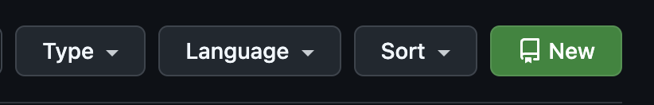

# Exercise 1 - Common Commands

## :bulb: Goal of Exercise 1

After completing this exercise, you should be able to:

- Configure Git on your own machine
- Learn some of the most commonly used Git commands in the CLI:
  - `git init` (Initialize a Git repository tracked both locally and on GitHub)
  - `git add` (Add files to the staging area)
  - `git commit` (Commit files to the local repository)
  - `git push` (Push files to the remote repository)
  - `git pull` (Fetch files from the remote repository)

## 1.1 - Configuring Git

:bulb: In this section, we will set up a configuration that describes "who you are" in Git. You can skip this part if you have already set it up. If `git config --global user.name` and `git config --global user.email` return your name and email address, you have already configured this.

:pencil2: Configure your name and email in the Git configuration:

```shell
git config --global user.name "Your Name"
git config --global user.email your.name@email.com
```

:book: Replace `Your Name` and `your.name@email.com` with your own name and email address.

:bulb: In some cases, you need an editor when using Git via the CLI, for example, when accepting a merge or rewriting commits. Depending on your operating system, the default choice may be set to notepad, vim, or nano. If you want to use a different editor, you can configure this.

### 1.1.1 - Configure the default editor (optional)

:book: If you do not want to configure the default editor for Git (i.e., you are satisfied with the one you are already using, such as vim or nano), you can skip this step.

:pencil2: To configure Git to use Visual Studio Code as the default editor, you can enter the following command in your terminal:

```shell
git config --global core.editor "code --wait"
```

## 1.2 - Create a git repository

:pencil2: Create a new empty directory on your machine that you can call `git-workshop-files` to avoid potential conflict with the name of this repo if you have cloned it. Make sure you are in this directory in your terminal.

:pencil2: Initialize a git repository. You do this with the command `git init`.
You will see the terminal respond:

```
Initialized empty Git repository in /[path to directory]/git-workshop-files/.git/
```

## 1.3 - First git commit

:pencil2: Add a file called `README.md`. Add appropriate text to the file (e.g., `"Nerdschool git workshop"`).

:pencil2: Check in the file to your local repository. You do this in two steps:

1. `git add README.md` adds the file to the repo's "staging area," where it is prepared to be committed.
2. `git commit -m "Initial commit"` commits the file to your local repository. `"Initial commit"` is the message associated with the commit. You can write whatever you want here, but `"Initial commit"` is often a good message to describe a repository's first commit.

:pencil2: Check the commit in the history. To see this in the terminal, you can type:

```
git log
```

:bulb: You have now created a git repository and made the first commit via the command line. Good job! Now we have all the work locally on our own machine, but we would like to check in the code to a central place.

:pencil2: Create a GitHub repository on github.com. If you do not have a GitHub account, you need to create one. Go to your profile and select the "Repositories" tab. Here you will find a large green button titled "New"

<div style="text-align: center">
  
</div>


:book: Choose an appropriate name under **`Repository name`** (Suggestion `nerdschool-git-workshop`). Do not select any other settings, and click **`Create repository`**.

:book: You will come to the following screen, where you need the bottom instructions (**`push an existing repository from the command line`**)

<div style="text-align: center">
  
</div>


:book: After you have followed the instructions on GitHub, you will have:

- Set up your local repository to track a "remote repository" / "remote origin".
- Renamed your Git branch to `main` (If you were on the `master` branch, it is now `main`).
- Pushed your changes to the remote origin

:pencil2: To simulate a change outside your own machine, click the pencil icon on github.com and change a file. In your terminal, type `git pull` to fetch the latest changes.

---

[:arrow_right: Go to the next exercise](../exercise-2/README.md)
