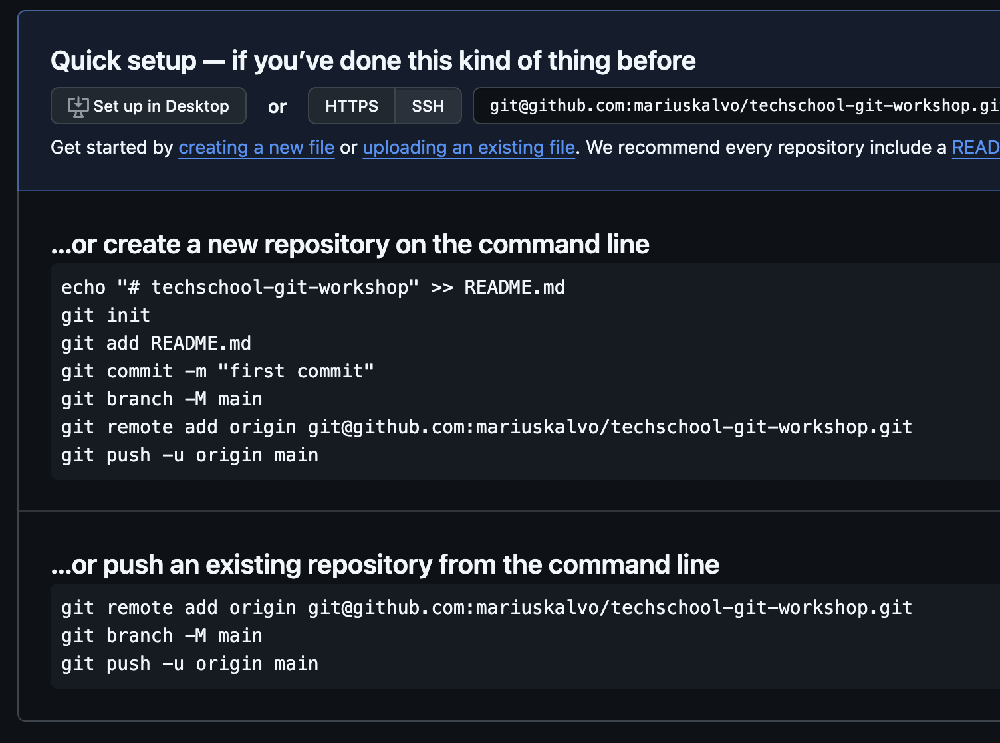

# Exercise 1 - Common Commands

## :bulb: Goal of Exercise 1

After completing this exercise, you should be able to:

- Configure Git on your own machine
- Learn some of the most commonly used Git commands in the CLI:
  - `git init` (Initialize a Git repository tracked both locally and on GitHub)
  - `git add` (Add files to the staging area)
  - `git commit` (Commit files to the local repository)
  - `git push` (Push files to the remote repository)
  - `git pull` (Fetch files from the remote repository)

## 1.1 - Configuring Git

:bulb: In this section, we will set up a configuration that describes "who you are" in Git. You can skip this part if you have already set it up. If `git config --global user.name` and `git config --global user.email` return your name and email address, you have already configured this.

:pencil2: Configure your name and email in the Git configuration:

```shell
git config --global user.name "Your Name"
git config --global user.email your.name@email.com
```

:book: Replace `Your Name` and `your.name@email.com` with your own name and email address.

:bulb: In some cases, you need an editor when using Git via the CLI, for example, when accepting a merge or rewriting commits. Depending on your operating system, the default choice may be set to notepad, vim, or nano. If you want to use a different editor, you can configure this.

### 1.1.1 - Configure the default editor (optional)

:book: If you do not want to configure the default editor for Git (i.e., you are satisfied with the one you are already using, such as vim or nano), you can skip this step.

:pencil2: To configure Git to use Visual Studio Code as the default editor, you can enter the following command in your terminal:

```shell
git config --global core.editor "code --wait"
```

## 1.2 - Create a git repository

:pencil2: Create a new empty directory on your machine that you can call `git-workshop-files` to avoid potential conflict with the name of this repo if you have cloned it. Make sure you are in this directory in your terminal. 

:bulb: **Tip**: You can create a directory with your terminal, using the `mkdir` command. E.g. `mkdir my-folder` to create a folder called `my-folder`. 


:bulb: **Tip**: If you have configured VS Code to be available in your `PATH` variable, you can open VS Code from your terminal by typing `code .` while you are in your directory. 

:pencil2: Make sure you are in your newly created folder in your terminal. Initialize a git repository. You do this with the command `git init`. 
You will see the terminal respond:

```
Initialized empty Git repository in /[path to directory]/git-workshop-files/.git/
```

## 1.3 - First git commit

:pencil2: Add a file called `README.md`. Add appropriate text to the file (e.g., `"Nerdschool git workshop"`).

:pencil2: Check the status of the file using the command `git status`. Here you should see the file you added under `Untracked files`. This means that the file exists in the filesystem, but has not yet been added to the "staging area".

<div style="text-align: center; margin-top: 2rem; margin-bottom: 2rem;">
  
</div>

:pencil2: Add the file to the staging area. You can do this with the command `git add README.md`. Check the status again with the command `git status`.

<div style="text-align: center; margin-top: 2rem; margin-bottom: 2rem;">
  
</div>

:pencil2: Create a commit that includes the file you created using the command `git commit -m <message>`. Write an appropriate commit message (`"Initial commit"` is often a suitable message for the first commit in a repository).

:pencil2: Check that you have a commit in your commit log by using the command `git log`. To exit `git log`, press `q`. 

<div style="text-align: center; margin-top: 2rem; margin-bottom: 2rem;">
  
</div>

:bulb: You have now created a git repository and made your first commit via the command line. Well done! Now we have all work locally on our own machine, but we would like to check in the code to a central location.


## 1.4 - Create GitHub Repository

### 1.4.1 - Add SSH key to Github
:bulb: To securely communicate with GitHub, we need to authenticate ourselves. We are going to add a SSH that the Git CLI client can access. This allows you to push and pull code without entering your password each time.

If you already have an SSH key set, you can skip `1.4.1. If you already have an SSH key, but it is not added to Github, go to the step to add the SSH key. [Docs - Check for existing SSH keys](https://docs.github.com/en/authentication/connecting-to-github-with-ssh/checking-for-existing-ssh-keys)

:pencil2: 
Go through the documentation steps described [here about creating an SSH key and adding it to your SSH agent](https://docs.github.com/en/authentication/connecting-to-github-with-ssh/generating-a-new-ssh-key-and-adding-it-to-the-ssh-agent#generating-a-new-ssh-key)

### 1.4.2 - Create Github repository

:pencil2: Create a GitHub repository on github.com. If you don't have a GitHub account, you'll need to create one. Go to your profile and select the "Repositories" tab. Here you'll find a large green button labeled "New"

<div style="text-align: center; margin-top: 2rem; margin-bottom: 2rem;">
  
</div>

:book: Choose an appropriate name under **`Repository name`** (Suggestion `nerdschool-git-workshop`). Do not select any other settings, and click **`Create repository`**.

:pencil2: You will come to the following screen. Follow bottom instructions (**`push an existing repository from the command line`**)

<div style="text-align: center; margin-top: 2rem; margin-bottom: 2rem;">
  
</div>

After following the instructions on Github, you will have:

- Set up your local repository to track a "remote repository" / "remote origin"
- Your Git branch named `main` (If you were on branch `master` it will now be `main`)
- Pushed your changes to remote origin

:pencil2: To simulate a change outside your own machine, click the pencil icon on github.com and edit a file. In your terminal, type `git pull` to fetch the latest changes.

---

[:arrow_right: Go to the next exercise](../exercise-2/README.md)
