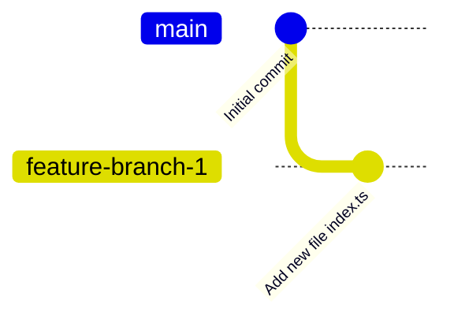
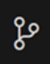
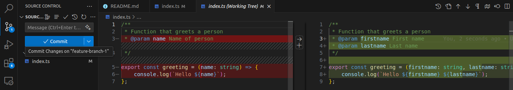
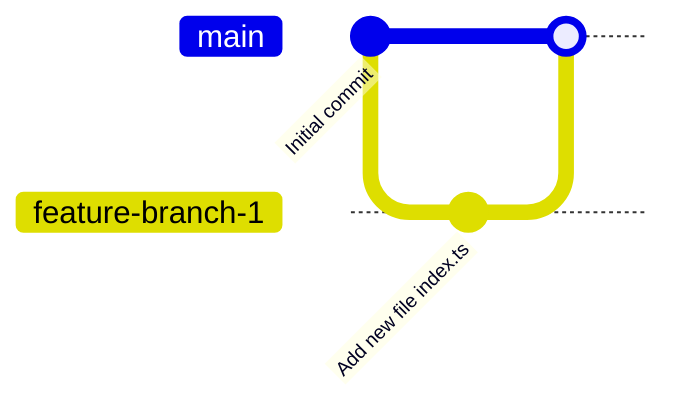
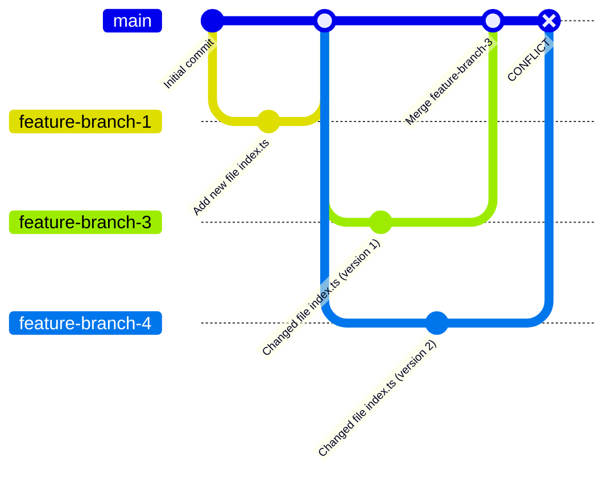
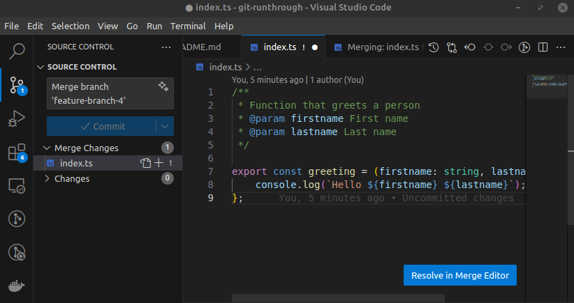
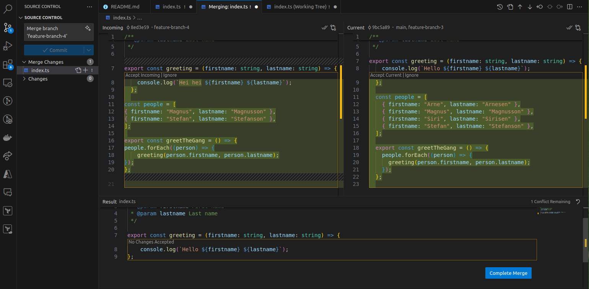
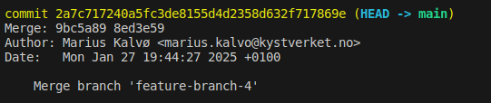
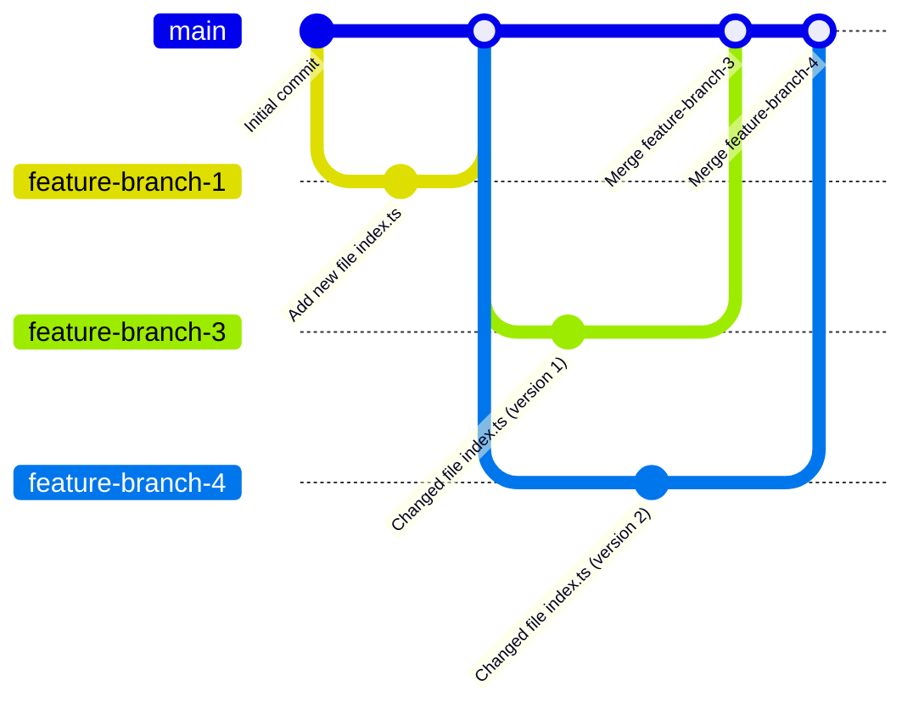

# Exercise 2 - Branches and Conflicts

## :bulb: Goals for Exercise 2

After this exercise, you will be able to:

- Create branches
- Merge branches
- Handle conflicts

## 2.1 - First Branch

### 2.1.1 - First Commit

When working together, it's very common to use git branches. When you create a branch, you break out into your own branch from the main branch, where you can work freely without affecting others' work.

:pencil2: Check that you are on the `main` branch (`git branch`) and then check out a new branch with the command `git checkout -b feature-branch-1`. This will check out a new branch named `feature-branch-1` that branches from where you were, `main`. Now you can freely work in this branch (and push the branch to a remote repository) and work undisturbed.

:pencil2: Create a file named `index.ts` in your repository and add the following content to the file. Commit the file to your local repository with an appropriate commit message.

```ts
/**
 * Function that greets a person
 * @param name Name of person
 */
export const greeting = (name: string) => {
  console.log(`Hello ${name}`);
};
```

:book: Below is a diagram to help you visualize how branching works: 


### 2.1.2 - Using `git diff`

:pencil2: Replace the contents of index.ts with the code snippet below. Then use `git diff` in your terminal to see what changes you have made.

```ts
/**
 * Function that greets a person
 * @param firstname First name
 * @param lastname Last name
 */
export const greeting = (firstname: string, lastname: string) => {
  console.log(`Hello ${firstname} ${lastname}`);
};
```

:bulb: `git diff` is useful when you want to see a small diff. If you need to inspect a larger diff, it's better to use the tool in VS Code or similar tools in other editors/IDEs. Below you can see where to find the git tool in VS Code.


You can find the `diff` tool in VS Code under the Source Control tab on your left hand side. 



:bulb: Your diff should look something like this 

<div style="text-align: center; margin-top: 2rem; margin-bottom: 2rem;">
  
</div>


:pencil2: Commit the changes to `index.ts`. Use an appropriate commit message of your choosing. 

## 2.2 - Merging branches

:bulb: When working together, we typically make changes in a branch and merge to a central branch (`main` or `master`). This way we can separate finished and unfinished code, and can work freely in our own branch until our work is ready to go into the central branch (and further out to production).

:bulb: When you merge a branch, we create a dedicated commit in the git history that describes the changes in the commits you're merging in. This acts as a bridge between the history in the 2 different branches and ensures we get a shared history in the branch we're merging into.

:pencil2: Incorporate the changes you made in `feature-branch-1` into the `main` branch. The commands below show how to check out the `main` branch, and then merge in the changes from your feature branch.

```sh
git checkout main
git merge feature-branch-1
```

:book: An editor window will open (e.g. Visual Studio Code, Vi, Nano). This is in case you want to further describe the merge commit.

:pencil2: Save and close the editor window to complete the merge.


:book: Below is an updated version of our diagram: 


## 2.3 - Conflicts

When multiple people work together, you often end up working in the same file and may change the same parts of the code. This happens relatively often when working in larger teams. For Git to know how changes should be consolidated, you need to resolve any conflicts. Now we will create an artificial conflict that we will resolve.

:pencil2: Check out a feature branch, `feature-branch-3`, from the `main` branch. Replace the contents of `index.ts` with the contents of `code/2.3-change-1.ts` from this repository. Commit the changes in your branch.

:pencil2: Check out the `main` branch, and from the `main` branch, create a new branch, `feature-branch-4`. Replace the contents of `index.ts` with the contents of `code/2.3-change-2.ts` from this repository. 


:pencil2: Merge `feature-branch-3` into the `main` branch. Then try to merge `feature-branch-4` into the `main` branch.

:bulb: We now have two feature branches with changes that should cause a conflict when we attempt to merge them both. Your git state should look something like this:



You should be notified in the CLI that your merge contains a conflict. Open the VS Code merge tool, by finding the file under the "Merge Changes" list under the Source Control tab in VS Code. Press **"Resolve in Merge Editor"** as shown below. 

<div style="text-align: center; margin-top: 2rem; margin-bottom: 2rem;">
  
</div>


:bulb: You will see 3 windows. A window on the left titled `Incoming` shows the changes from the branch being merged into `main`. You have a window called `Current` which shows the content in main. Finally, you have a `Result` window at the bottom that shows what the final merge will look like.

<div style="text-align: center; margin-top: 2rem; margin-bottom: 2rem;">
  
</div>

:pencil2: Select `Accept Incoming` in the `Incoming` window to choose which side to keep. Then click `Complete Merge`.

:pencil2: To complete the merge, go to your terminal to stage the merged file with `git add index.ts`. Then complete the merge with the command `git merge --continue`. You will get an editor window where you can describe the merge commit in more detail. Close this window to accept the merge commit.

:pencil2: Check `git log`. You should now have a merge commit in your log.

<div style="text-align: center; margin-top: 2rem; margin-bottom: 2rem;">
  
</div>


:bulb: Now we have merged a branch with conflicts into `main`. A good strategy is to keep your feature branch updated against `main` and resolve conflicts that way. This gives you the opportunity to resolve the conflict and ensure that the content in your feature branch works as intended, and avoid conflicts for `main`.

If you have branches that live for a long time without synchronizing with `main`, you risk complex conflicts. If you need to maintain a long-lived branch, always merge in `main` frequently.

:bulb: Looking at your `main` branch, this graph should now represent your git history, with two merge commits from `feature-branch-3` and `feature-branch-4`.


---

[:arrow_right: Go to the next exercise](../exercise-3/README.md)
