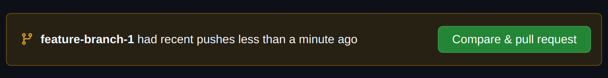
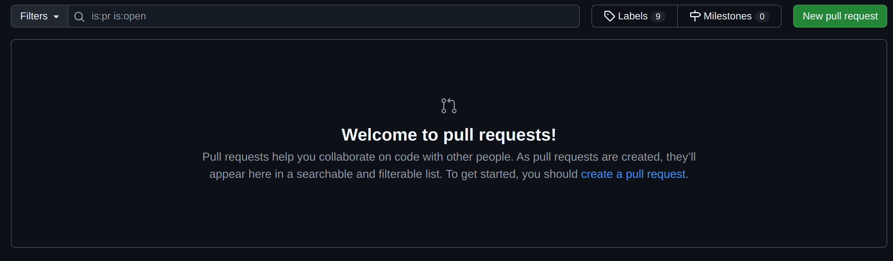
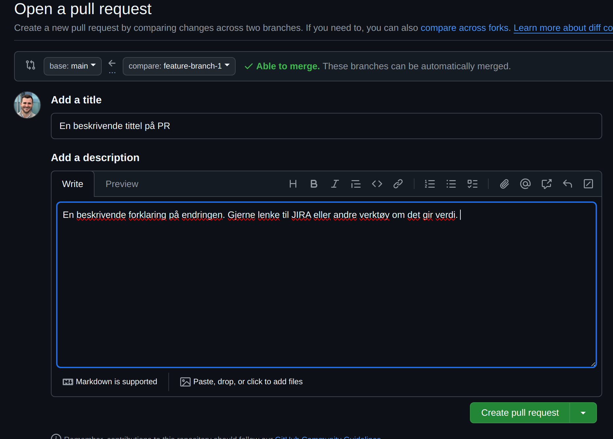

# Exercise 3 - Using Github

## :bulb: Goals for Exercise 3

When working on systems that need to function at all times, pull requests and code reviews are important tools. By creating a pull request, you get to describe changes, and your colleagues can participate in discussions and suggest improvements. Additionally, it serves as a good mechanism for documenting why a change was made.

This is an open exercise. The goal is for you to spend time getting familiar with how to create pull requests (PR), write comments, and perform a pull request review.

### 3.1 Creating a pull request

:pencil2: Check out a new branch with a name of your choice. Create a new file with some content, and commit it to the branch.

:bulb: When you try to push a branch for the first time to a remote repository, you will get an error message saying it doesn't have an "upstream branch". Here Git tells you what you need to do for your branch to be tracked in the remote repository

```
git push --set-upstream origin <branch name>
```

:pencil2: Push branch to remote repository.

There are several shortcuts to access the interface for creating a pull request. When you push changes to a remote repository, you'll get a link in your terminal that you can follow to create a PR. Alternatively, if you've recently pushed to a branch, you'll get a pop-up to create a pull request from that branch.

<div style="text-align: center; margin-top: 2rem; margin-bottom: 2rem;">
  
</div>

If you haven't pushed recently to a branch, you can create a pull request via "New pull request" on the right side of the screen.

<div style="text-align: center; margin-top: 2rem; margin-bottom: 2rem;">
  
</div>

You will then be able to choose which branch you want to create a PR for. For example here, I can choose `feature-branch-1`.

<div style="text-align: center; margin-top: 2rem; margin-bottom: 2rem;">
  
</div>

You will see a form for creating a PR. Here you can describe what specific changes have been made. This is useful both to give the person doing the review necessary information, but also gives us the ability to go back and see under what circumstances this change was introduced.

<div style="text-align: center; margin-top: 2rem; margin-bottom: 2rem;">
  
</div>
:pencil2: Create a pull request in GitHub.

:pencil2: Start a pull request review on your own PR. Try adding a comment for the change, linked to a specific line of code. Approve or reject the PR. You can start a review by going to the `Files changed` tab, and write a comment by clicking the `+` icon next to a code line number on a change. You can complete the review by clicking `Review changes` in the upper right corner. You usually aren't allowed to approve or reject your own PR, but you can do that when reviewing a PR that someone else has created. Click around and familiarize yourself with the interface.

:pencil2: Merge the pull request into `main`. You do this in the `Conversations` tab, at the very bottom.

:bulb: It's smart to delete the branch after merging it into `main`. This avoids clutter in the remote repository. After you've merged a pull request, you'll get a button for this.

---

[:arrow_right: Go to the next exercise](../exercise-4/README.md)
