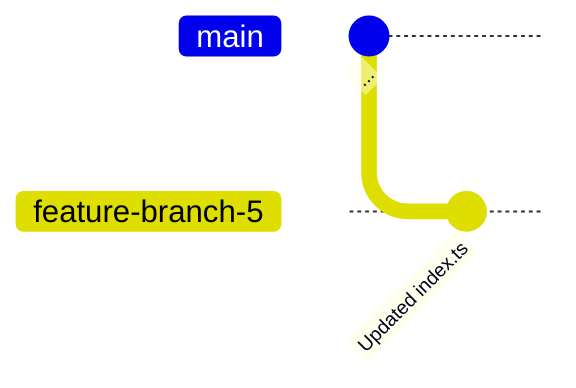
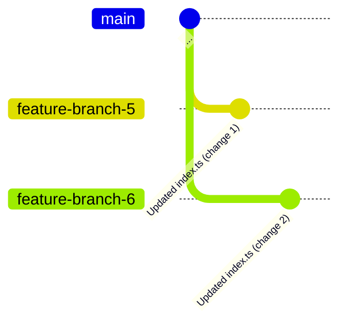
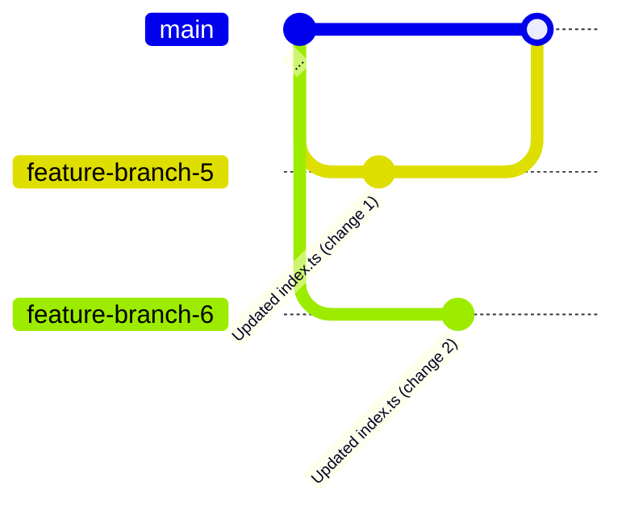
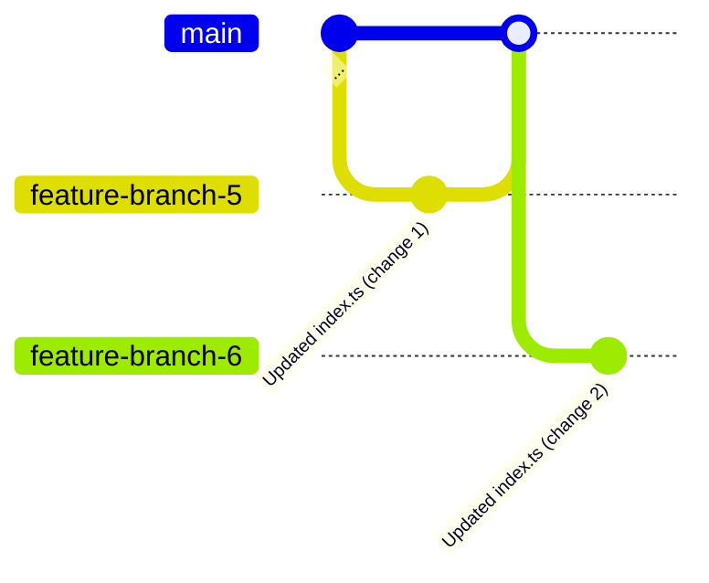
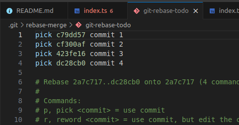
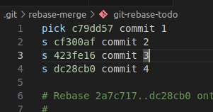
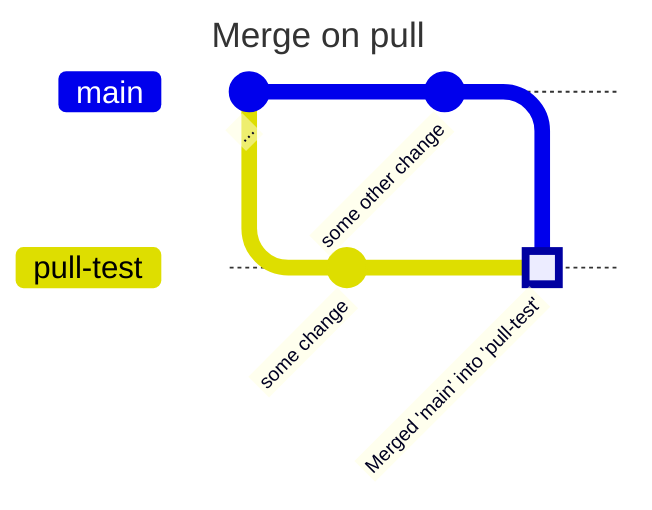
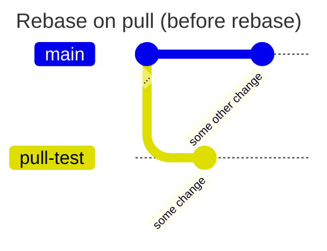
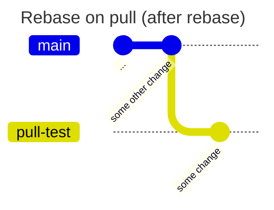

# Exercise 4 - Rebasing

## :bulb: Goals for Exercise 4

After this exercise, you will be able to:

- Use `git rebase` to merge changes
- Use `git rebase` in interactive mode
- Use `git pull --rebase` to use rebase when pulling down changes

### 4.1 - Git rebase

We will now put ourselves in a situation similar to before, where we need to merge changes. Instead of using `git merge`, we will use `git rebase`.

:pencil2: Checkout the `main` branch. Pull the latest changes from your pull request that was merged into `main` using `git pull`.

:pencil2: Check out a feature branch, `feature-branch-5`, from the `main` branch. Replace the contents of `index.ts` with the contents of `code/4.1-change-1.ts`. Commit the changes in your branch.



:pencil2: Check out the `main` branch, and from the `main` branch, create a new branch, `feature-branch-6`. Replace the contents of `code/index.ts` with the contents of `code/4.1-change-2.ts`.



:pencil2: Merge `feature-branch-5` into `main`.



:pencil2: Go into `feature-branch-6`. Rebase the changes from `main` into `feature-branch-6`. You can do this with the following command:

```
git rebase main
```



:bulb: You generally never want to rebase in main. That would rewrite the history in the shared working branch.

### 4.2 - Git rebase interactive
When you're in a feature branch, you might sometimes want to rewrite commits you've checked in, for example by combining commits or changing a commit message. You can do this with `git rebase` in interactive mode.

We'll use interactive rebase to combine commits.

:pencil2: We are going to create some fictive commit messages that we are going to rebase. In this exercise, you choose your own commit messages and content changes. Do the following tasks: 
- Check out a branch from the `main` branch. Choose your own branch name.
- Create a file, or make changes to an existing file.
- Create a commit.
- Repeat the file change and new commit 3 more times, until you have 4 commits in your branch.

:pencil2: Push your branch to the remote repository.

:pencil2: Use `git rebase` in interactive mode to combine commits. Use the following command:

```
git rebase -i main
```

You will now see an editor window with commits that have happened in your branch since you branched out from `main`. In the example below, there are 4 commits in a branch: `commit 1`, `commit 2`, `commit 3`, `commit 4`.



In the last 3 rows, you can replace the value `pick` with either `s` or `squash`. Squash will combine the commit with the commit above it. As in the case below, `commit 4` will be combined with `commit 3`, which combines with `commit 2`, which combines with `commit 1` (we keep `pick` on `commit 1`).



:pencil2: Save and close the file. You will get a new editor window. Here you can write a new commit message for the combined commits. Remove the content in the file and write an appropriate message. Then save and close the file that appeared.

:pencil2: Try to push the change to the remote repository. You will get a message that the change is not accepted. This is because we have rewritten the history.

:pencil2: Push to branch using the command `git push --force-with-lease`.

:bulb: When you have rewritten the history on a branch that is tracked in a remote repository, you must push changes with a force flag for the change to be accepted. It's tempting to use `git push -f` (or `--force`) which forces the change in. This is OK when working alone. When working in a team, you risk overwriting others' work. It's smart to use the command `git push --force-with-lease` instead, as this forces in the change only if no one else has made any changes since you last pulled the branch.

### 4.3 - Git pull --rebase

:bulb: When you run `git pull`, Git performs a `git fetch` followed by a `git merge`. However, you can use `git pull --rebase` to perform a `git fetch` followed by a `git rebase` instead. This can help maintain a cleaner, more linear history by avoiding merge commits.

When using `git pull --rebase`, your local commits are temporarily set aside, the remote changes are pulled down, and then your local commits are replayed on top of the updated branch. This creates a linear history instead of creating a merge commit like a regular `git pull` would do.

:pencil2:  Let's simulate this difference:
1. Create a new branch called `pull-test` from main
2. Make a change and commit it
3. Go back to main and make a different change and commit it
4. Go to `pull-test` and try `git pull` to merge main's changes - notice the merge commit
5. Reset the branch with `git reset --hard HEAD~2`
6. Try `git pull --rebase` instead - notice the linear history









---

[:arrow_right: Go to next exercise](../exercise-5/README.md)
