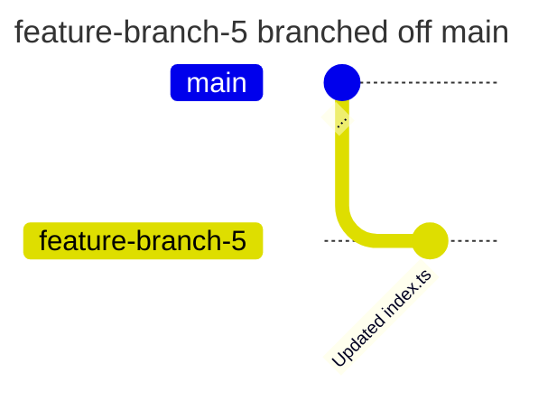
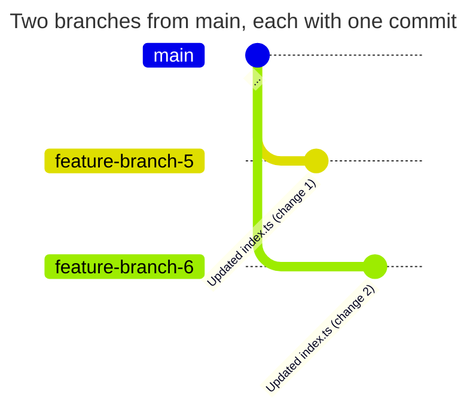
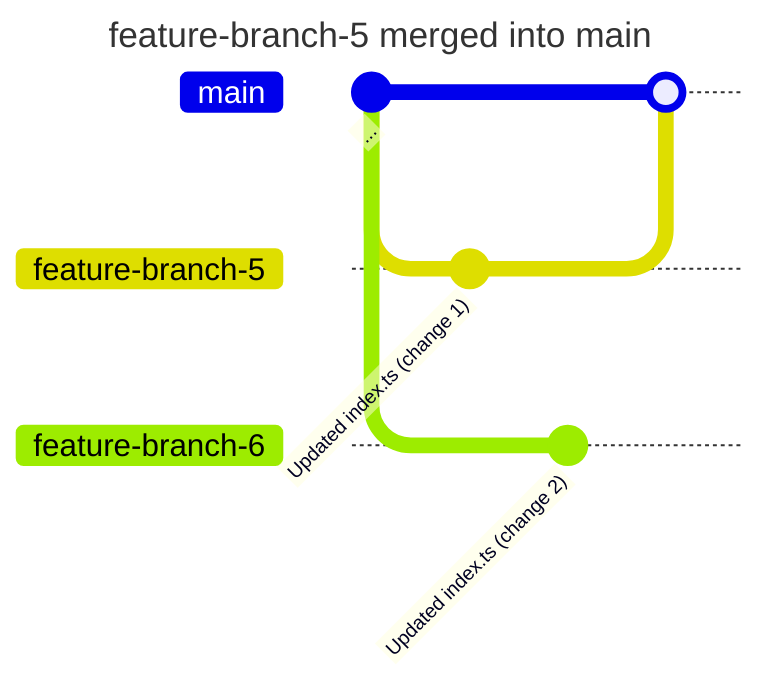
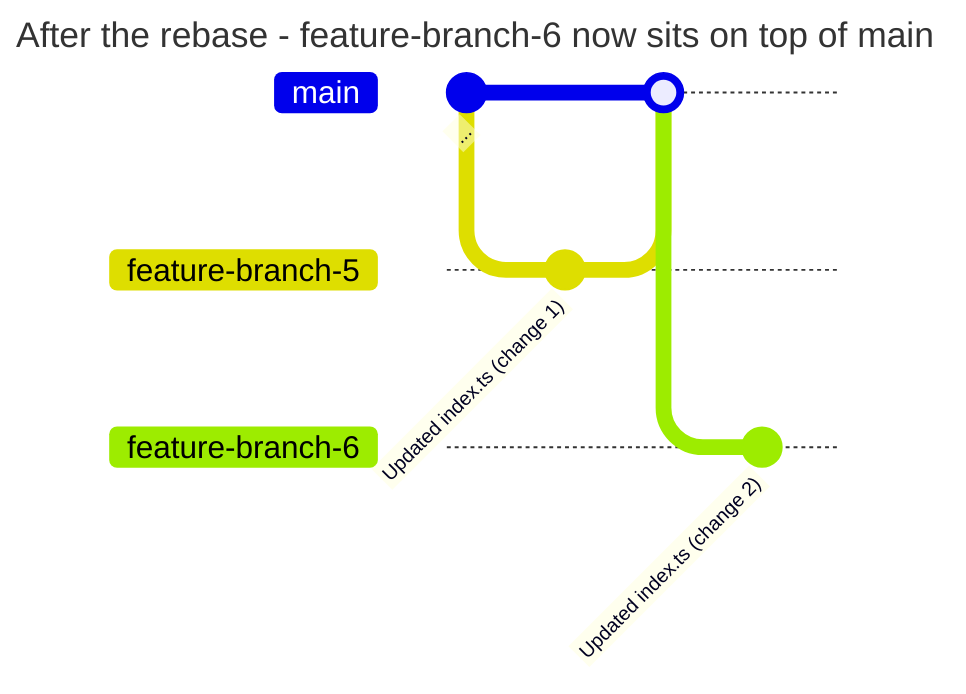
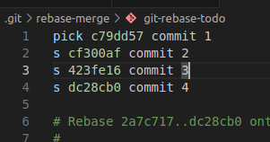
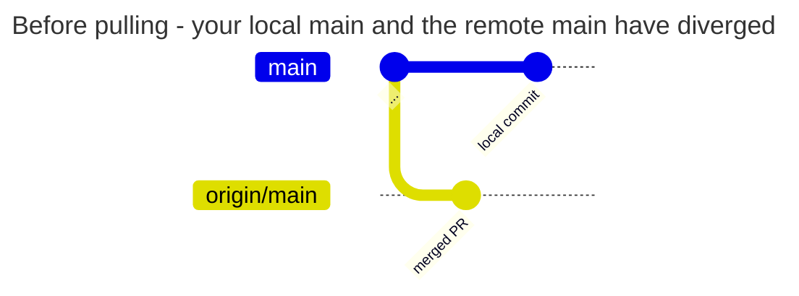
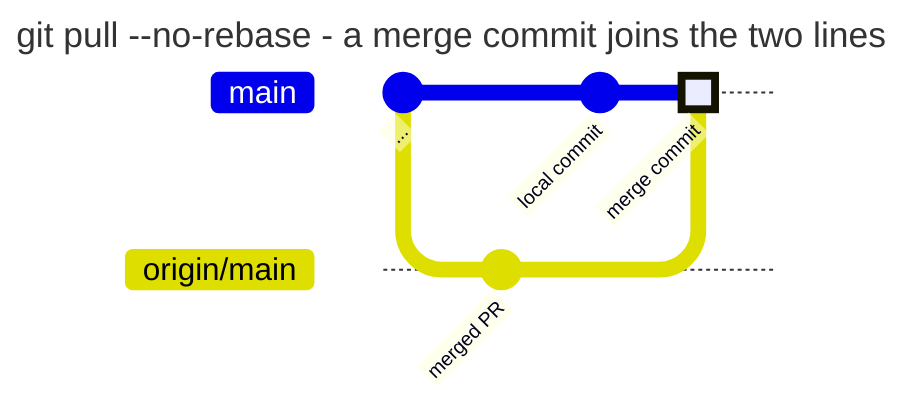
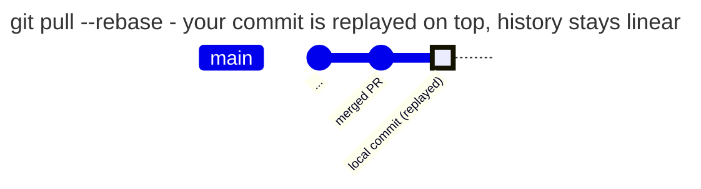

# Exercise 4 - Rebasing

## :bulb: Goals for Exercise 4

After this exercise, you will be able to:

- Use `git rebase` to merge changes
- Use `git rebase` in interactive mode
- Use `git pull --rebase` to use rebase when pulling down changes

## 4.1 - Git rebase

We will now put ourselves in a situation similar to before, where we need to merge changes. Instead of using `git merge`, we will use `git rebase`.

:pencil2: Checkout the `main` branch. Pull the latest changes from your pull request that was merged into `main` using `git pull`.

:pencil2: Check out a feature branch, `feature-branch-5`, from the `main` branch. Replace the contents of `index.ts` with the contents of `code/4.1-change-1.ts` from this repository. Commit the changes in your branch.


```mermaid
---
title: feature-branch-5 branched off main
---
gitGraph
   commit id: "..."
   branch feature-branch-5
   commit id: "Updated index.ts"
```

:pencil2: Check out the `main` branch, and from the `main` branch, create a new branch, `feature-branch-6`. Replace the contents of `index.ts` with the contents of `code/4.1-change-2.ts` from this repository. Commit the changes in your branch.

:exclamation: As in exercise 2, do not skip the commit - an uncommitted change follows you when you switch branches and will block the next merge.


```mermaid
---
title: Two branches from main, each with one commit
---
gitGraph
   commit id: "..."
   branch feature-branch-5
   commit id: "Updated index.ts (change 1)"
   checkout main
   branch feature-branch-6
   commit id: "Updated index.ts (change 2)"
```

:pencil2: Merge `feature-branch-5` into `main`, again asking for a merge commit: `git merge --no-ff feature-branch-5`.


```mermaid
---
title: feature-branch-5 merged into main
---
gitGraph
   commit id: "..."
   branch feature-branch-5
   commit id: "Updated index.ts (change 1)"
   checkout main
   branch feature-branch-6
   commit id: "Updated index.ts (change 2)"
   checkout main
   merge feature-branch-5
```

:pencil2: Go into `feature-branch-6`. Rebase the changes from `main` into `feature-branch-6`. You can do this with the following command:

```
git rebase main
```


```mermaid
---
title: After the rebase - feature-branch-6 now sits on top of main
---
gitGraph
   commit id: "..."
   branch feature-branch-5
   commit id: "Updated index.ts (change 1)"
   checkout main
   merge feature-branch-5
   branch feature-branch-6
   commit id: "Updated index.ts (change 2)"
```

:bulb: Note that the commit on `feature-branch-6` is not the same commit as before. Rebasing replays your commits on top of the new base, which creates **new commits with new hashes**. The old ones are discarded.

:pencil2: Use the Merge Editor in VS Code, and resolve your conflict, just like you did in the previous exercise with normal merging

:pencil2: After resolving the conflict, add the file to the staging area using `git add .`

:pencil2: Continue rebasing by using the command `git rebase --continue` in your terminal

:pencil2: After you have finished rebasing onto `main`, checkout the `main` branch and merge `feature-branch-6` in with a plain `git merge feature-branch-6`. Since we have rebased our branch onto `main`, we have rewritten the history in the branch so that it seems our work always was "on top of" the work in main, and we can easily merge our work.

:bulb: This time Git reports `Fast-forward` and creates no merge commit. That is the whole point of rebasing: because your commits already sit directly on top of `main`, merging is just moving a pointer, and the resulting history is a straight line.

:bulb: You generally never want to rebase in main. That would rewrite the history in the shared working branch.

## 4.2 - Git rebase interactive
When you're in a feature branch, you might sometimes want to rewrite commits you've checked in, for example by combining commits or changing a commit message. You can do this with `git rebase` in interactive mode.

We'll use interactive rebase to combine commits.

:pencil2: We are going to create some fictive commit messages that we are going to rebase. In this exercise, you choose your own commit messages and content changes. Do the following tasks: 
- Check out a branch from the `main` branch. Choose your own branch name.
- Create a file, or make changes to an existing file.
- Create a commit.
- Repeat the file change and new commit 3 more times, until you have 4 commits in your branch.

:pencil2: Push your branch to the remote repository.

:pencil2: Use `git rebase` in interactive mode to combine commits. Use the following command:

```
git rebase -i main
```

You will now see an editor window with commits that have happened in your branch since you branched out from `main`. In the example below, there are 4 commits in a branch: `commit 1`, `commit 2`, `commit 3`, `commit 4`.


In the last 3 rows, you can replace the value `pick` with either `s` or `squash`. Squash will combine the commit with the commit above it. As in the case below, `commit 4` will be combined with `commit 3`, which combines with `commit 2`, which combines with `commit 1` (we keep `pick` on `commit 1`).



:pencil2: Save and close the file. You will get a new editor window. Here you can write a new commit message for the combined commits. Remove the content in the file and write an appropriate message. Then save and close the file that appeared.

:pencil2: Try to push the change to the remote repository. You will get a message that the change is not accepted. This is because we have rewritten the history.

:pencil2: Push to branch using the command `git push --force-with-lease`.

:bulb: When you have rewritten the history on a branch that is tracked in a remote repository, you must push changes with a force flag for the change to be accepted. It's tempting to use `git push -f` (or `--force`) which forces the change in. This is OK when working alone. When working in a team, you risk overwriting others' work. It's smart to use the command `git push --force-with-lease` instead, as this forces in the change only if no one else has made any changes since you last pulled the branch.

## 4.3 - Git pull --rebase

:bulb: When you run `git pull`, Git performs a `git fetch` followed by a `git merge`. However, you can use `git pull --rebase` to perform a `git fetch` followed by a `git rebase` instead. This can help maintain a cleaner, more linear history by avoiding merge commits.

When using `git pull --rebase`, your local commits are temporarily set aside, the remote changes are pulled down, and then your local commits are replayed on top of the updated branch. This creates a linear history instead of creating a merge commit like a regular `git pull` would do.

:exclamation: Since Git 2.27, running a plain `git pull` when your local branch and the remote branch have both moved on will not merge - it stops with `fatal: Need to specify how to reconcile divergent branches.` You therefore have to tell Git which behaviour you want, either once and for all with `git config --global pull.rebase false`, or per command with the `--no-rebase` flag used below.

:pencil2:  Let's simulate this difference:
1. Create a new branch called `pull-test` from `main`.
2. Make a change and commit it. Push it to github.com, and merge it to `main` using a pull request.
3. Go back to the `main` branch and make a different change and commit it straight to the `main` branch.
4. On the `main` branch, run `git pull --no-rebase` to pull the changes from the remote - notice the merge commit it creates.
5. Undo that pull with `git reset --hard ORIG_HEAD`.
6. Try `git pull --rebase` instead - notice the linear history and that the commit you added straight to `main` is now placed after your merged PR.

:bulb: `ORIG_HEAD` is a bookmark Git writes before any operation that moves your branch a lot, such as a merge, a pull, a rebase or a reset. `git reset --hard ORIG_HEAD` therefore means "put me back where I was before that last big move", which is exactly what we want in step 5. It is safer than counting commits with `HEAD~1`, which would depend on whether you actually got a merge commit.

:bulb: Careful with the `--hard` flag in the future. Don't use this uncritically - it throws away uncommitted work in your working directory. This is a massive foot-gun.


```mermaid
---
title: Before pulling - your local main and the remote main have diverged
---
gitGraph
   commit id: "..."
   branch origin/main
   commit id: "merged PR"
   checkout main
   commit id: "local commit"
```


```mermaid
---
title: git pull --no-rebase - a merge commit joins the two lines
---
gitGraph
   commit id: "..."
   branch origin/main
   commit id: "merged PR"
   checkout main
   commit id: "local commit"
   merge origin/main type: HIGHLIGHT id: "merge commit"
```


```mermaid
---
title: git pull --rebase - your commit is replayed on top, history stays linear
---
gitGraph
   commit id: "..."
   commit id: "merged PR"
   commit id: "local commit (replayed)" type: HIGHLIGHT
```


---

[:arrow_right: Go to next exercise](../exercise-5/README.md)
