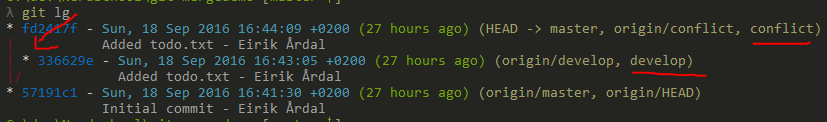

# Exercise 3 - Solving a merge conflict

A merge tool is a tool that compare different versions of a file side by side and let you manually pick and choose lines in order to solve the conflict. First we must install such a tool. We're going to use KDiff3.

## In this exercise we will
- Learn about merging and merge tools
- Use KDiff3 for merging

## 3.1 - Getting started

:pencil2: Do the following steps:

- Download and install a merge tool ([KDiff3](http://kdiff3.sourceforge.net/))

- Configure git to use KDiff3 as the default merge tool.

- Type the following from the Stack Owerflow post into your terminal without copy & pasting http://stackoverflow.com/a/33348841

- Go to https://github.com/nerdschoolbergen/git-mergedemo
  * In the "Branches" dropdown list, verify that there are 3 branches: master, develop, and conflict.
  * Change the current branch to be develop and verify that the contents of todo.txt is
  ```
  Things to do today:
  Nothing
  ```
  * Change the current branch to be conflict and verify that the content is now
  ```
  Things to do today:
  All the things!
  ```
- `git clone` the git-mergedemo repository so you can work with it on your computer.
- `git status` and verify you're on the master branch.

As you now know, the content of todo.txt is different on the two branches. We're now going to merge both develop and conflict into master since that's where we want to synchronize everything.

- Type `git branch -l` to list all branches

You only clone the default branch, so only master will show up here. But we just saw on GitHub that there are more branches.

- Type `git checkout develop`. This should return a message saying we now have a local branch that tracks the remote develop branch (the origin)

- Type `git checkout conflict`. This should do the same thing for the conflict branch.

- Type `git branch -l`. This should now list master, develop, and conflict

Figure out which branch you're on, then, making sure you're on the master branch, do...

 - `git merge develop`
 - `git status`

So far, so good.

- `git merge conflict`

```
Auto-merging todo.txt
CONFLICT (add/add): Merge conflict in todo.txt
Automatic merge failed; fix conflicts and then commit the result.
```

This means git couldn't figure out how to combine the todo.txt with the one we already have.

:bulb: The name "conflict" is just the name of the branch in this case. It could of course be anything.

- Open todo.txt in a text editor.

```
Things to do today:
<<<<<<< HEAD
Nothing
=======
All the things!
>>>>>>> conflict
```

So not only was Git not able to merge the files, it put in some weird stuff and made it all worse! Let's understand what's going on here.

The content between `<<<<<<< HEAD` and `=======` is what git found at it's HEAD, meaning the latest commit on the current branch.

The content between `=======` and `>>>>>>> conflict` is what we tried to merge into master but couldn't.

#### Solving manually

There is nothing magical about the auto generated content in the file. The easiest way to solve this conflict is simply to delete the stuff you don't want and save the file with the content you deem correct. For example,
```
Things to do today:
Nothing
```
If you save the file like this, git is happy and you can continue to commit the changes.

* `git status` - everything should look ok - no warning about a conflict now.
* `git add --a`
* `git commit -m "Solved nasty merge conflict"`
* `git status` to verify all is still good. Use this command a lot.

:bulb: Git won't allow you to continue as long as the `<<<<<<<< HEAD` and so on is present in a file. You must solve all of these issues in your codebase before you can commit, or checkout branches.

#### Solving using a merge tool

Sometimes when there are many lines and many files that has conflicts, it can be hard to read and understand a file with the auto generated merge conflict text. After all, this will be in files with hundreds of lines of code that must compile and work after you're done merging. This is where many people turn to using a merge tool (although you don't have to use one if you don't want to).

:pencil2: We're going to undo our last commit and re-do the merge.

In order to undo our local commit, first we must know it's ID.

- Type `git log` into your terminal.

A series of git commits should be listed along with a long SHA-1 code which is the ID of the commit. Don't worry, you don't need to write it all, typically git understands what you mean by just typing 4-6 of the first characters of the ID.

For me, the the log looks like this:

```
commit 0a4eacc090bfe17400ac8e9847c1d7bc3bd9cb6b
Merge: 336629e fd2417f
Author: Eirik Årdal <eaardal@outlook.com>
Date:   Sun Sep 18 17:25:59 2016 +0200

    Solved merge

commit fd2417f000bb80e62766016802f000d07a339a21
Author: Eirik Årdal <eaardal@outlook.com>
Date:   Sun Sep 18 16:44:09 2016 +0200

    Added todo.txt

commit 336629e4bf3225ff50dd77b8863f4120cd5808ab
Author: Eirik Årdal <eaardal@outlook.com>
Date:   Sun Sep 18 16:43:05 2016 +0200

    Added todo.txt

commit 57191c16a9666137b311a11dd48d62d42adc6312
Author: Eirik Årdal <eaardal@outlook.com>
Date:   Sun Sep 18 16:41:30 2016 +0200

    Initial commit
```

I want to reset to before I got the merge conflict in order to re-do it. This is the commit with ID starting at `fd2417`.

I'm going to use the first bit, `fd2417`, as the ID. Git understands the rest.

* `git reset --hard fd2417`

You should see a message about HEAD being at a different commit now.

* Verify that we are on a different commit in the log now

By inspecting the log again, we see that the conflict branch and master is on the same commit while develop has diverged.
<br/>


* Merge develop into master again.

> Remember that when doing git merge, you're merging the target branch into the current branch.

The conflict should be back now. Great!

Open the file in the default merge tool, KDiff3

- Type `git mergetool todo.txt` into your terminal.

A program with 3 windows should pop up and the terminal window is locked until we have exited and closed the KDiff3 process.

Window A (top left corner) should be named Local and is the content of the local branch you tried to merge into master.

Window B (top right corner) should be named Remote and is the content git has at HEAD

Output (bottom window) is the result.

The workflow here is easy: you choose and pick lines from Window A and B to make the final version in Output.

- Right click on the line `<Merge Conflict>` in Output. It should give you the option to Select lines from A/B. Pick one.

Save the file and close KDiff3 enitrely. The terminal should resume and fininsh the previous `git mergetool` command which has been locking the terminal until now.

- Type `git status` into your terminal

```
Untracked files:
  (use "git add <file>..." to include in what will be committed)

        todo.txt.orig
        todo_BACKUP_7068.txt
        todo_BASE_7068.txt
        todo_LOCAL_7068.txt
        todo_REMOTE_7068.txt
```

Since merge conflict can (and will) go horribly bad sometimes, and people for some reason _hate_ to rewrite code caused by this, most merge tools automatically creates backup files of each version you worked with. You can look these over if you think you missed something, but typically we just delete them.

- Delete all files listed as new (all files in the example above) by using the terminal only.

- Doing a `git status` should say you're ahead by 1 commit but note the part which says **All conflicts fixed but you are still merging.
  (use "git commit" to conclude merge)**.

- Follow the instructions in the message and finish up.

- Verify all looks good with `git lg`

:tada:

### [Go to bonus exercise](./exercise-4-bonus.md)
