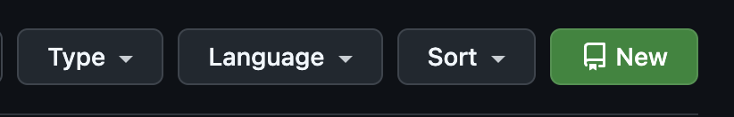
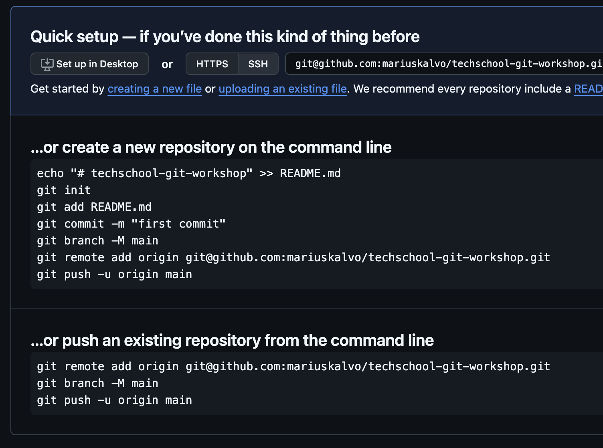

# Oppgave 1 - Vanlige kommandoer

## :bulb: Mål med Oppgave 1

Etter denne oppgaven skal du kunne å:

- Konfigurere git på egen maskin
- Lære noen av de mest brukte kommandoene i CLIen:
  - `git init` (Initialisere git-repository som spores både lokalt og på Github)
  - `git add` (Legge til filer i staging-området)
  - `git commit` (Commit'e filer til i lokalt repository)
  - `git push` (Push'e filer til remote repository)
  - `git pull` (Hente filer fra remote repository)

## Oppsett av git-config

:bulb: I denne seksjonen skal vi sette opp konfigurasjon som beskriver "hvem du er" i git. Du kan hoppe over denne delen om dette er alt noe du har satt opp. Om `git config --global user.name` og `git config --global user.email` returnerer ditt navn og epost-adresse, har du alt satt dette opp.

:pencil2: Konfigurer navn og epost i git-konfigurasjonen din

```
git config --global user.name "Ditt Navn"
git config --global user.email ditt.navn@epost.no
```

Erstatt `Ditt Navn` og `ditt.navn@epost.no` med ditt eget navn og epostadresse.

:bulb: I enkelte tilfeller trenger du en editor når du bruker Git via CLI, eksempelvis når du skal godta en merge eller skrive om commits. Avhengig av hvilket operativsystem du bruker, kan standardvalget være satt til notepad, vim eller nano. Ønsker du å bruke en annen editor, kan du konfigurere dette.

:pencil2: Konfigurer standard editor (valgfritt)

Om du ikke vil konfigurere standard editor for git (dvs. du er fornøyd med den du alt bruker, f.eks. vim eller nano), kan du hoppe over dette steget.

For å konfigurere Git til å bruke Visual Studio Code som standard editor, kan du føre inn følgende kommando i terminalen din:

```
git config --global core.editor "code --wait"
```

## Opprett git repository

:pencil2: Opprett en ny tom katalog på maskinen din som du kan kalle `git-workshop-files` for å unngå potensiell konflikt med navnet på dette repoet om du har klonet det ned. Sørg for at du står i denne katalogen i terminalen din.

:pencil2: Initialiser et git repository. Dette gjør du med kommandoen `git init`.
Du vil se terminalen svare tilbake:

```
Initialized empty Git repository in /[sti til katalog]/git-workshop-files/.git/
```

## Første git commit

:pencil2: Legg til en fil som heter `README.md`. Legg en passende tekst i filen (f.eks. `"Techschool git workshop"`).

:pencil2: Sjekk inn filen i ditt lokale repository. Dette gjør du i to steg:

1. `git add README.md` legger til filen i repoets "staging-område", der det gjøres klart til å commites.
2. `git commit -m "Initial commit"` commiter filen til ditt lokale repository. `"Initial commit"` er meldingen som er tilknyttet commit'en. Du kan skrive hva du vil her, men `"Intial commit"` er ofte en god melding for å beskrive et repository sin første commit.

:pencil2: Sjekk commit'en i historikken. For å se dette i terminalen kan du skrive

```
git log
```

:bulb: Du har nå opprettet et git-repository og lagt inn første commit via kommandolinjen. Bra jobba! Nå har vi alt arbeid lokalt på egen maskin, men vi ønsker gjerne å sjekke inn koden et sentralt sted.

:pencil2: Opprett et Github-repository på github.com. Har du ikke en github-konto, må du opprette dette. Gå inn på din profil og velg fane "Repositories". Her vil du finne en stor grønn knapp med tittel "New"

<div style="text-align: center">
  
</div>


Velg et passende navn under **`Repository name`** (Forslag `techschool-git-workshop`). Ikke velg noen andre innstillinger, og trykk **`Create repository`**.

Du vil komme til følgende skjermbilde, om du må de nederste instruksene (**`push an existing repository from the command line`**)

<div style="text-align: center">
  
</div>


Etter du har utført instruksene i Github, vil ha:

- Satt opp ditt lokale repository til å spore et "remote repository" / "remote origin".
- Git branchen din navnet `main` (Om du sto på branch `master` blir denne nå `main`).
- Pushet endringene dine til remote origin

:pencil2: For å simulere en endring utenfor egen maskin, trykk på blyant-ikonet på github.com, og endre en fil. I terminalen din, skriv `git pull` for å hente ned siste endringer.

---

[:arrow_right: Gå til neste oppgave](../oppgave-2/README.md)
