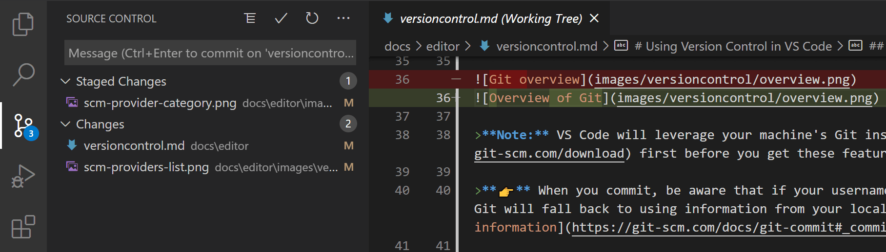

# Oppgave 2 - Brancher og konflikter

## :bulb: Mål med Oppgave 2

Etter denne oppgaven skal du kunne å:

- Opprette brancher
- Merge brancher
- Håndtere konflikter

## 2.1 - Første branch

### 2.1.1 - Første commit

Når en arbeider sammen, er det svært vanlig å bruke git branches. Når du lager en branch, bryter du ut i en egen gren fra hoved-branchen, der du kan arbeide fritt uten å påvirke andre sitt arbeid.

:pencil2: Sjekk at du står i `main` branch (`git branch`) og sjekk deretter ut en ny branch med kommandoen `git checkout -b feature-branch-1`. Da vil du sjekke ut en ny branch med navn `feature-branch-1` som går ut fra branchen du sto på, `main`. Nå kan du fritt arbeide i denne branchen (og pushe branchen til et remote repository) og arbeide uforstyrret.

:pencil2: Opprett en fil som heter `index.ts` i repositoriet ditt og legg følgende innhold inn i filen. Sjekk filen inn i lokalt repository med en passende commit-melding.

```ts
export const greeting = (name: string) => {
  console.log(`Hello ${name}`);
};
```

### 2.1.2 - Bruk av `git diff`

:pencil2: Erstatt innholdet i `index.ts` med kodesnutten under. Bruk deretter `git diff` for å se hvilke endringer du har utført.

```ts
export const greeting = (firstname: string, lastname: string) => {
  console.log(`Hello ${firstname} ${lastname}`);
};
```

:bulb: `git diff` er nyttig når du vil se en liten diff. Skal du inspisere en større diff, er det lurt å bruke verkøyet i VS Code eller tilsvarende verktøy i andre editorer/IDEer. Under ser du hvor du finner git-verktøyet i VS Code.



## 2.2 - Merging av brancher

:bulb: Når vi arbeider sammen, gjør vi gjerne endringer i en branch og merger til en sentral branch (`main` eller `master`). Slik kan vi skille ferdig og uferdig kode, og kan arbeide fritt i egen branch frem til arbeidet vårt er klart til å gå inn i sentral branch (og videre ut til produksjon).

:bulb: Når du merger en branch, oppretter vi en egen commit i git-historikken som beskriver endringene i commitene du merger inn. Dette fungere som en bro mellom historikken i de 2 forskjellige branchene og gjør at vi får en felles historikk i branchen i merger inn i.

:pencil2: Ta inn endringene du gjorde i `feature-branch-1` inn i `main` branch. Kommandoene under viser hvordan du sjekker ut `main` branch, og deretter fletter inn endringene fra din feature-branch.

```sh
git checkout main
git merge feature-branch-1
```

Du vil få opp et editor-vindu (f.eks. Visual Studio Code, Vi, Nano). Dette er i tilfelle du vil beskrive merge-commiten videre.

:pencil2: Lagre og lukk editor-vinduet for å fullføre merge.

## 2.3 - Konflikter

Når en er flere som arbeider sammen, ender man ofte opp med å jobbe i samme fil, og kan komme til å endre de samme delene av koden. Dette skjer relativt ofte når en arbeider i større team. For at git skal vite hvordan endringer skal konsolideres, må en løse eventuelle konflikter. Nå skal vi lage en kunstig konflikt, som vi skal løse.

:pencil2: Sjekk ut en feature-branch, `feature-branch-3`, fra `main` branch. Erstatt innholdet i `index.ts` med innholdet i `code/2.3-endring-1.ts`. Sjekk endringene inn i en commit i branchen din.

:pencil2: Sjekk ut `main` branch, og ut i fra `main` branch, opprett en ny branch, `feature-branch-4`. Erstatt innholdet i `code/index.ts` med innholdet i `code/2.3-endring-2.ts`.

:pencil2: Merge `feature-branch-3` inn i `main` branch. Forsøk deretter å merge `feature-branch-4` inn i `main` branch.

:bulb: Nå har vi merget en branch med konflikter inn i `main`. En god strategi er å holde din feature-branch oppdatert mot `main` og løse konflikter den veien. Da har du anledning til å løse konflikten og påse at innholdet i feature-branchen din fungere som det skal, og slipper konflikter for `main`.

Har du brancher som lever over lang tid, uten at du synkroniserer med `main`, risikerer du komplekse konflikter. Må du holde på en langtlevende branch; merge alltid inn `main` ofte.

---

[:arrow_right: Gå til neste oppgave](../oppgave-3/README.md)
